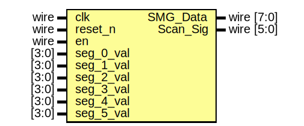

# AX530 scanning seven segment driver

- **File**: seven_seg_scan.v
- **Author:** Mallory Sutter (sir.oslay@gmail.com)
- **Date:** 2022-08-26
- **Brief:** The seven segment LED display on the AX530 can have only one segment active at a time, so displaying unique values requires scanning through each segment
## Diagram

## Ports

| Port name | Direction | Type       | Description                                     |
| --------- | --------- | ---------- | ----------------------------------------------- |
| clk       | input     | wire       | clock (50 MHz)                                  |
| reset_n   | input     | wire       | active low reset                                |
| en        | input     | wire       | active high enable                              |
| SMG_Data  | output    | wire [7:0] | Seven segment LED signals (active low)          |
| Scan_Sig  | output    | wire [5:0] | Determines which segment is active (active low) |
| seg_0_val | input     | [3:0]      | Value to display on segment 0 (right-most)      |
| seg_1_val | input     | [3:0]      | Value to display on segment 1                   |
| seg_2_val | input     | [3:0]      | Value to display on segment 2                   |
| seg_3_val | input     | [3:0]      | Value to display on segment 3                   |
| seg_4_val | input     | [3:0]      | Value to display on segment 4                   |
| seg_5_val | input     | [3:0]      | Value to display on segment 5 (left-most)       |
## Signals

| Name      | Type       | Description                                            |
| --------- | ---------- | ------------------------------------------------------ |
| count     | reg [15:0] | Timer count                                            |
| shift_reg | reg [5:0]  | Shift register that determines which segment is active |
| seg_val   | reg [3:0]  | The value of the active segment                        |
## Constants

| Name        | Type | Value     | Description                                                                             |
| ----------- | ---- | --------- | --------------------------------------------------------------------------------------- |
| count_limit |      | 16'd49999 | This sets each segment to have a 1 ms on-time (1 ms x 6 segments = 167 Hz refresh rate) |
## Processes
- segment_value_mux: ( @* )
  - **Type:** always
- shift_reg_on_slow_clk: ( @ (posedge clk or negedge reset_n) )
  - **Type:** always
## Instantiations

- seg_inst: seven_seg
