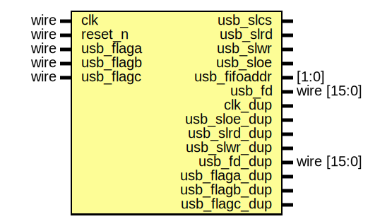
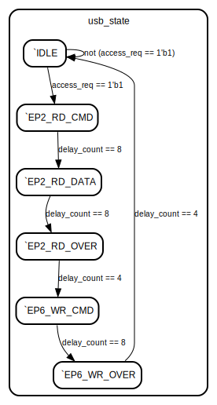

# USB FIFO test module

- **File**: usb_test.v
- **Author:** Mallory Sutter (sir.oslay@gmail.com)
- **Version:** 1.0
- **Date:** 2022-08-26
- **Brief:** FX2LP USB FIFO test module for the ALINX AX530 dev board
- **Details:** If the FIFO of EP2 is not empty and the EP6 is not full, Read the 16bit data from EP2 FIFO and send to EP6 FIFO.
## Diagram

## Ports

| Port name     | Direction | Type        | Description                                        |
| ------------- | --------- | ----------- | -------------------------------------------------- |
| clk           | input     | wire        | Clock (50 MHz)                                     |
| reset_n       | input     | wire        | Reset                                              |
| usb_flaga     | input     | wire        | CY68013 EP2 FIFO empty flag; 1:not empty; 0: empty |
| usb_flagb     | input     | wire        | CY68013 EP4 FIFO empty flag; 1:not empty; 0: empty |
| usb_flagc     | input     | wire        | CY68013 EP6 FIFO full flag; 1:not full; 0: full    |
| usb_slcs      | output    |             | CY68013 chip select (active low)                   |
| usb_slrd      | output    |             | CY68013 read control (active low)                  |
| usb_slwr      | output    |             | CY68013 write control (active low)                 |
| usb_sloe      | output    |             | CY68013 data output enable (active low)            |
| usb_fifoaddr  | output    | [1:0]       | CY68013 FIFO Address                               |
| usb_fd        | inout     | wire [15:0] | CY68013 FIFO data bus                              |
| clk_dup       | output    |             | Duplicate for debugging                            |
| usb_sloe_dup  | output    |             | Duplicate for debugging                            |
| usb_slrd_dup  | output    |             | Duplicate for debugging                            |
| usb_slwr_dup  | output    |             | Duplicate for debugging                            |
| usb_fd_dup    | output    | wire [15:0] | Duplicate for debugging                            |
| usb_flaga_dup | output    |             | Duplicate for debugging                            |
| usb_flagb_dup | output    |             | Duplicate for debugging                            |
| usb_flagc_dup | output    |             | Duplicate for debugging                            |
## Signals

| Name        | Type       | Description                                                      |
| ----------- | ---------- | ---------------------------------------------------------------- |
| data_reg    | reg [15:0] | Temporary read/write data storage                                |
| bus_busy    | reg        | Active high when the module is sending or receiving data         |
| access_req  | wire       | Active high when it's possible to read or write to/from the FIFO |
| usb_fd_en   | reg        | Tri-state output enable for `usb_fd`                             |
| usb_state   | reg [5:0]  | State machine register                                           |
| delay_count | reg [4:0]  | Used to delay state changes                                      |
## Processes
- duplicate_signals: ( @* )
  - **Type:** always
- rd_wr_state_machine: ( @(posedge clk or negedge reset_n) )
  - **Type:** always
## State machines

- Used to delay state changes